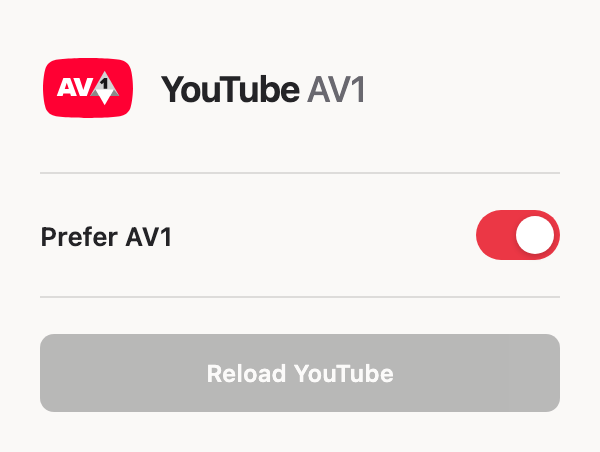
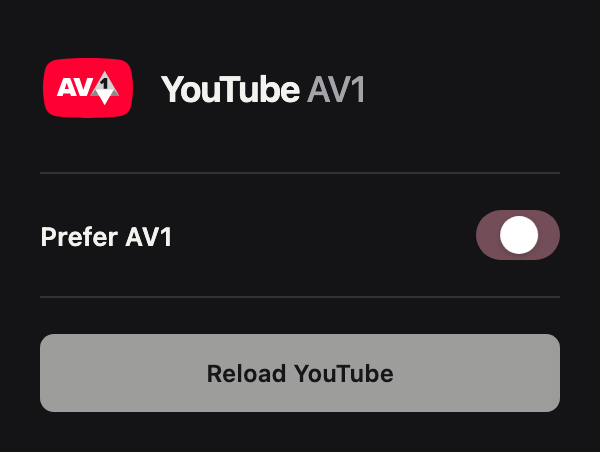

<p align="center">
  
</p>

<h1 align="center">Force YouTube AV1</h1>

<p align="center">Give YouTube a chance to deliver clearer video with less data.</p>

<p align="center">
  <a href="LICENSE"></a>
  <a href="https://github.com/aytekaksu/youtube-av1/actions/workflows/checks.yml"></a>
</p>

A small, free browser extension that asks YouTube to prefer **AV1**, a video format that can keep more detail while using less data. It is especially useful to try on a slower connection, a mobile hotspot, or a limited data plan.

It lets YouTube consider AV1 even when your device has no dedicated AV1 decoding hardware. Your browser can use the device's main processor instead.

## Why use it?

AV1 is a more efficient way to pack video for the internet. When YouTube offers a suitable AV1 version, that can mean:

- **Less data for similar picture quality.** Useful if you have a data cap or pay for mobile data.
- **Better picture quality at a similar data rate.** More detail may fit through the same connection.
- **A chance to watch at a higher resolution on a slower connection.** A smaller stream may be easier to keep up with and may buffer less.

These are possible benefits, not a promise for every video. YouTube still chooses the stream, and not every video or resolution is available in AV1. If YouTube already uses AV1, this extension may make no difference. Choosing a higher resolution can use up the data savings. The extension does not speed up your internet, sharpen the original video, or unlock paid quality options.

[Learn about AV1 from its creators, AOMedia.](https://aomedia.org/specifications/av1/)

## The tradeoff: more work for your device

**Decoding** means turning the downloaded video into the pictures you watch. Many devices have a small, efficient hardware decoder for common video formats. Older devices may not have one for AV1.

On those devices, your browser can decode AV1 in software, using the **CPU**—the main processor. Compared with hardware decoding, this can mean more CPU use, more heat, louder fans, and more battery or wall power use.

The extra battery use may be small on some devices and much larger on others, especially at 4K or high frame rates. It is not always just a slight increase. If your processor cannot keep up, the video may stutter even when your internet connection is fast enough.

Try it on the videos you normally watch. If playback becomes choppy or battery life matters more, turn **Prefer AV1** off and reload the video. The extension does not force software decoding when your browser can use AV1 hardware decoding.

## Simple controls

<table>
  <tr>
    <th>Dark appearance</th>
    <th>Light appearance</th>
  </tr>
  <tr>
    <td></td>
    <td></td>
  </tr>
</table>

Turn **Prefer AV1** on or off. **Reload YouTube** becomes available when the active YouTube tab needs the changed setting. The button reloads only that tab. Your choice is saved on your device; other open YouTube tabs need their own reload. The popup follows your system's light or dark appearance.

<details>
<summary>See the reload button after changing the setting</summary>



</details>

Screenshots show the actual popup rendered with simulated browser state. They are UI examples, not measurements of data savings or playback quality.

## Install

Use a desktop Chromium-based browser such as Chrome or Vivaldi. This is a manual installation; there is no store listing yet. Vivaldi has been used locally; other browsers and devices may behave differently.

1. [Download the source ZIP](https://github.com/aytekaksu/youtube-av1/archive/refs/heads/main.zip) and unzip it into a folder you will keep.
2. Open `chrome://extensions` in Chrome, or `vivaldi://extensions` in Vivaldi.
3. Turn on **Developer mode**.
4. Click **Load unpacked** and select the folder containing `manifest.json`.
5. Pin **Force YouTube AV1** from your browser's extensions menu, then open or reload a YouTube video.

**Prefer AV1** is on by default. No account, subscription, or build step is needed. The extension needs a browser based on Chromium 111 or newer, with a working AV1 decoder. It does not install a decoder. The normal mobile YouTube app is not supported.

To update, replace the files in the same folder, click the extension's **Reload** button on your browser's extensions page, then reload your YouTube tabs.

## Check that it is working

1. Right-click a playing YouTube video.
2. Choose **Stats for nerds**.
3. Look at **Codecs**. A video codec beginning with **`av01`** means AV1 is playing.

The switch shows your preference, not proof of the codec in use. If you still see `vp09` or `avc1`, YouTube may have chosen another format. Try a different video or resolution. If **Dropped Frames** keeps increasing during normal playback, your device may be struggling to decode the video; try a lower resolution or switch the extension off.

## How it works

Before choosing a stream, YouTube can ask your browser which video formats it can play, whether playback should be smooth, and whether it should use little power. [YouTube has described using these checks to choose video streams.](https://web.dev/case-studies/youtube-media-capabilities)

This extension changes the answers YouTube sees for AV1. It says AV1 is supported, smooth, and power efficient, and supplies YouTube's older AV1 preference. That encourages YouTube to consider AV1 even when it would normally avoid software decoding.

**Those answers are a way to encourage AV1, not measurements or guarantees.** The extension does not make decoding more power efficient. It cannot create an AV1 version of a video, guarantee that YouTube selects it, or guarantee smoother playback.

Everything runs in your browser. YouTube sends the video directly to you, as usual. See [the technical notes](docs/how-it-works.md) for the exact browser APIs and limitations.

## Privacy and permissions

The extension has no analytics, advertising, accounts, or server. Its code does not collect or send your watch history or other browsing data.

- **Storage:** saves the on/off choice locally.
- **Scripting:** applies the preference and checks whether the active YouTube tab needs a reload.
- **YouTube site access:** limited to `www.youtube.com`, `m.youtube.com`, and `www.youtube-nocookie.com` (embedded players).

YouTube's own data collection still applies while you use YouTube. See [PRIVACY.md](PRIVACY.md).

## Development and contributions

The extension uses plain HTML, CSS, and JavaScript with no runtime dependencies. Run the checks with Node.js 20 or newer:

```sh
node scripts/check.cjs
node tests/behavior.cjs
```

See [CONTRIBUTING.md](CONTRIBUTING.md) for local development, screenshot generation, and pull requests. **Changes require the repository owner's approval before merging.**

## License and credits

Original source code and documentation are available under the [MIT License](LICENSE). You can use, change, and share them, including commercially, under its terms.

The editable logo is [assets/logo.svg](assets/logo.svg). The AV1 mark comes from [AOMedia's official logo resources](https://aomedia.org/resources/logo/). Third-party logos and trademarks retain their owners' rights and are not relicensed under MIT. See [NOTICE.md](NOTICE.md).

This is an independent project, not affiliated with or endorsed by YouTube, Google, or AOMedia.
