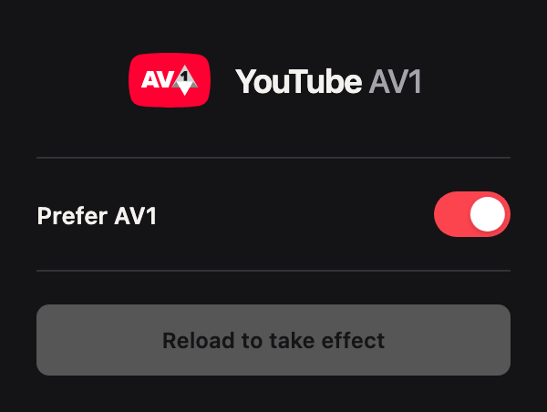

<h1 align="center">Force YouTube AV1</h1>

Prefer AV1 on YouTube for **less data use or clearer video on a slower connection**. AV1 must be available for the video, and results vary by device.

## Install

1. [Download version 0.1](https://github.com/aytekaksu/youtube-av1/releases/download/v0.1/youtube-av1-0.1.0.zip), unzip it, and keep the folder.
2. Open `chrome://extensions` in Chrome or `vivaldi://extensions` in Vivaldi. Turn on **Developer mode**.
3. Click **Load unpacked** and select the extracted folder containing `manifest.json`.

No build or account needed. Desktop Chrome and Vivaldi only; not the YouTube mobile app.

## Use

Open a YouTube video and click the extension icon. **Prefer AV1** starts on. After changing it, click **Reload to take effect**.

To check playback, right-click the video → **Stats for nerds** → look for **`av01`** under Codecs.

## How it helps

AV1 packs video more efficiently. This can save data at similar quality or fit better quality through the same connection. Choosing a higher resolution may use up those savings.

The extension tells YouTube your browser supports AV1. Without AV1 hardware, your CPU does the decoding, which can use more battery/power or cause stuttering. Turn it off if your device struggles. It does not guarantee AV1 or a quality improvement.

Runs locally with no analytics. [Privacy](PRIVACY.md) · [Contribute](CONTRIBUTING.md) · [MIT license](LICENSE) · [Logo credits](NOTICE.md)
